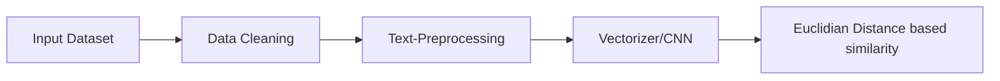

# Amazon Fashion Recommendation System

## Objective:
Given a query point, recommend similar apparel products in e-commerce.

## Flow of the code is as follow:
#### Flow chart:

```mermaid
graph LR
A[Input Dataset] --> B[Data Cleaning]
B --> C[Text-Preprocessing]
C --> D[Vectorizer/CNN]
D --> E[Euclidian Distance based similarity]
```
